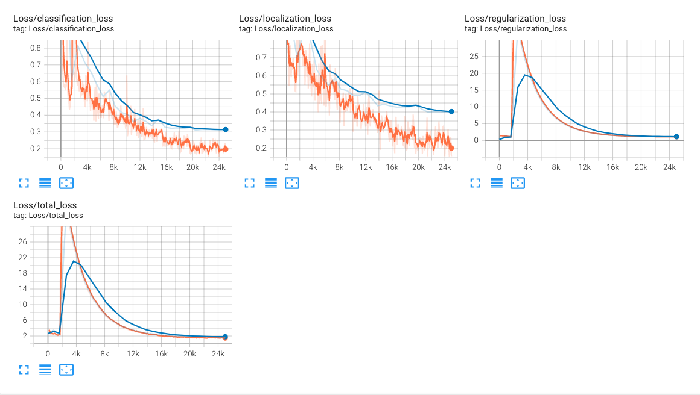
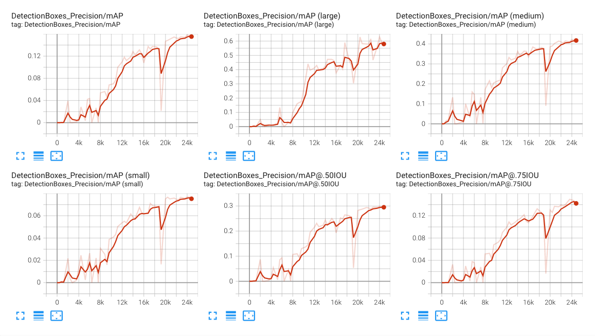
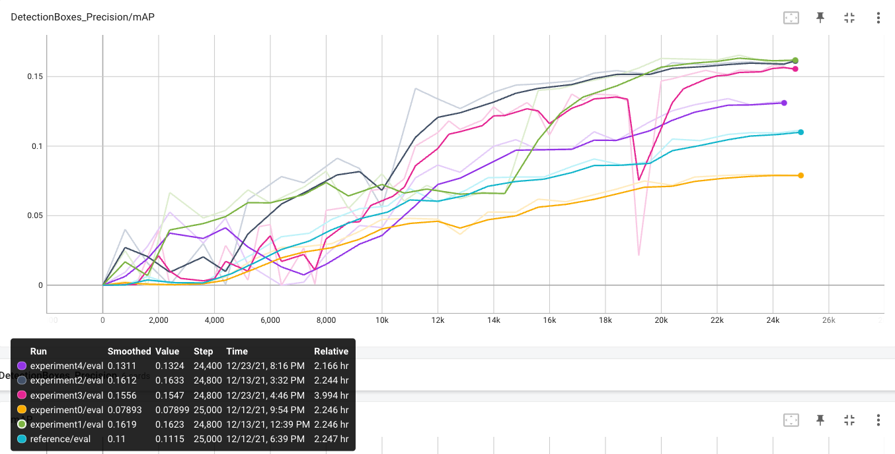

# Object Detection in an Urban Environment

## Data

For this project, we will be using data from the [Waymo Open dataset](https://waymo.com/open/).

The data you will use for training, validation and testing is organized as follow:
```
/home/workspace/data/waymo
    - processed - contains files to train and validate your models (only sample of the data provided directly in repository)
    - train: contain the train data (empty at start)
    - val: contain the val data (empty at start)
    - test: contain the val data (empty at start)
```

The `processed` folder contains files that have been downsampled: we have selected one every 10 frames from 10 fps videos. The `test` folder contains frames from the 10 fps video without downsampling.

You will split this `processed` data into `train`, and `val` sets by completing and executing the `create_splits.py` file.

### Experiments
The experiments folder will be organized as follow:
```
experiments/
    - pretrained_model/
    - exporter_main_v2.py - to create an inference model
    - model_main_tf2.py - to launch training
    - reference/ - reference training with the unchanged config file
    - experiment0/ - create a new folder for each experiment you run
    - experiment1/ - create a new folder for each experiment you run
    - experiment2/ - create a new folder for each experiment you run
    - label_map.pbtxt
    ...
```

## Prerequisites

### Local Setup

For local setup if you have your own Nvidia GPU, you can use the provided Dockerfile and requirements in the [build directory](./build).

Follow [the README therein](./build/README.md) to create a docker container and install all prerequisites.

### Download and process the data

The first goal of this project is to download the data from the Waymo's Google Cloud bucket to your local machine. For this project, we only need a subset of the data provided (for example, we do not need to use the Lidar data). Therefore, we are going to download and trim immediately each file. In `download_process.py`, you can view the `create_tf_example` function, which will perform this processing. This function takes the components of a Waymo Tf record and saves them in the Tf Object Detection api format. An example of such function is described [here](https://tensorflow-object-detection-api-tutorial.readthedocs.io/en/latest/training.html#create-tensorflow-records). We are already providing the `label_map.pbtxt` file.

You can run the script using the following command:
```
python download_process.py --data_dir {processed_file_location} --size {number of files you want to download}
```

You are downloading 100 files (unless you changed the `size` parameter) so be patient! Once the script is done, you can look inside your `data_dir` folder to see if the files have been downloaded and processed correctly.

### Classroom Workspace

In the classroom workspace, every library and package should already be installed in your environment. You will NOT need to make use of `gcloud` to download the images.

## Instructions

### Exploratory Data Analysis

You should use the data already present in `/home/workspace/data/waymo` directory to explore the dataset! This is the most important task of any machine learning project. To do so, open the `Exploratory Data Analysis` notebook. In this notebook, your first task will be to implement a `display_instances` function to display images and annotations using `matplotlib`. This should be very similar to the function you created during the course. Once you are done, feel free to spend more time exploring the data and report your findings. Report anything relevant about the dataset in the writeup.

Keep in mind that you should refer to this analysis to create the different spits (training, testing and validation).


### Create the training - validation splits
In the class, we talked about cross-validation and the importance of creating meaningful training and validation splits. For this project, you will have to create your own training and validation sets using the files located in `/home/workspace/data/waymo`. The `split` function in the `create_splits.py` file does the following:
* create three subfolders: `/home/workspace/data/train/`, `/home/workspace/data/val/`, and `/home/workspace/data/test/`
* split the tf records files between these three folders by symbolically linking the files from `/home/workspace/data/waymo/` to `/home/workspace/data/train/`, `/home/workspace/data/val/`, and `/home/workspace/data/test/`

Use the following command to run the script once your function is implemented:
```
python create_splits.py --data-dir /home/workspace/data
```

### Edit the config file

Now you are ready for training. As we explain during the course, the Tf Object Detection API relies on **config files**. The config that we will use for this project is `pipeline.config`, which is the config for a SSD Resnet 50 640x640 model. You can learn more about the Single Shot Detector [here](https://arxiv.org/pdf/1512.02325.pdf).

First, let's download the [pretrained model](http://download.tensorflow.org/models/object_detection/tf2/20200711/ssd_resnet50_v1_fpn_640x640_coco17_tpu-8.tar.gz) and move it to `/home/workspace/experiments/pretrained_model/`.

We need to edit the config files to change the location of the training and validation files, as well as the location of the label_map file, pretrained weights. We also need to adjust the batch size. To do so, run the following:
```
python edit_config.py --train_dir /home/workspace/data/train/ --eval_dir /home/workspace/data/val/ --batch_size 2 --checkpoint /home/workspace/experiments/pretrained_model/ssd_resnet50_v1_fpn_640x640_coco17_tpu-8/checkpoint/ckpt-0 --label_map /home/workspace/experiments/label_map.pbtxt
```
A new config file has been created, `pipeline_new.config`.

### Training

You will now launch your very first experiment with the Tensorflow object detection API. Move the `pipeline_new.config` to the `/home/workspace/experiments/reference` folder. Now launch the training process:
* a training process:
```
python experiments/model_main_tf2.py --model_dir=experiments/reference/ --pipeline_config_path=experiments/reference/pipeline_new.config
```
Once the training is finished, launch the evaluation process:
* an evaluation process:
```
python experiments/model_main_tf2.py --model_dir=experiments/reference/ --pipeline_config_path=experiments/reference/pipeline_new.config --checkpoint_dir=experiments/reference/
```

To monitor the training, you can launch a tensorboard instance by running `python -m tensorboard.main --logdir experiments/reference/`. You will report your findings in the writeup.

### Improve the performances

Most likely, this initial experiment did not yield optimal results. However, you can make multiple changes to the config file to improve this model. One obvious change consists in improving the data augmentation strategy. The [`preprocessor.proto`](https://github.com/tensorflow/models/blob/master/research/object_detection/protos/preprocessor.proto) file contains the different data augmentation method available in the Tf Object Detection API. To help you visualize these augmentations, we are providing a notebook: `Explore augmentations.ipynb`. Using this notebook, try different data augmentation combinations and select the one you think is optimal for our dataset. Justify your choices in the writeup.

Keep in mind that the following are also available:
* experiment with the optimizer: type of optimizer, learning rate, scheduler etc
* experiment with the architecture. The Tf Object Detection API [model zoo](https://github.com/tensorflow/models/blob/master/research/object_detection/g3doc/tf2_detection_zoo.md) offers many architectures. Keep in mind that the `pipeline.config` file is unique for each architecture and you will have to edit it.

### Creating an animation
#### Export the trained model
Modify the arguments of the following function to adjust it to your models:

```
python experiments/exporter_main_v2.py --input_type image_tensor --pipeline_config_path experiments/reference/pipeline_new.config --trained_checkpoint_dir experiments/reference/ --output_directory experiments/reference/exported/
```

This should create a new folder `experiments/reference/exported/saved_model`. You can read more about the Tensorflow SavedModel format [here](https://www.tensorflow.org/guide/saved_model).

Finally, you can create a video of your model's inferences for any tf record file. To do so, run the following command (modify it to your files):
```
python inference_video.py --labelmap_path label_map.pbtxt --model_path experiments/reference/exported/saved_model --tf_record_path /data/waymo/testing/segment-12200383401366682847_2552_140_2572_140_with_camera_labels.tfrecord --config_path experiments/reference/pipeline_new.config --output_path animation.gif
```

## Project Summary

### Project overview
This project aims to utilize Tensorflow Object Detection API for object detection task in image data captured by on-car camera. Waymo Open Dataset is used as a source of training, validation and test data. The goal is to detect cars, pedestrians and cyclists, and correctly classify them. Self-driving car task relies heavily on object detection / image data since it brings a lot of information about surrounding world.

### Set up
#### Jupyter Notebook and lightweight TF Objection Detection API usage

Directory `build/` contains Docker image specification useful for TF Object Detection API operations like pipeline.config extraction, model inference or data download. It's definitely not suitable for training because it doesn't utilize GPU.

Makefile of the project contains set of commands for easier work with Docker image:
```bash
# Commands useful on host machine
build-container: ## Build testing Docker container without GPU support
	cd build; docker build -t nd013-c1-vision-starter -f Dockerfile .; cd ..

run-container: ## Run testing Docker container
	cd build; docker run -v ${PWD}:/app/project/ -p 8899:8888 --shm-size 2g -ti nd013-c1-vision-starter bash; cd ..

open-jupyter: ## Open running Jupyter Notebook in default browser
	open http://localhost:8899

tensorboard: ## Show experiment results in tensorboard
	tensorboard serve --logdir experiments/

# Commands useful in running Docker container
run-jupyter: ## Run Jupyter notebook in Docker container
	jupyter notebook --allow-root --ip 0.0.0.0 --port 8888 --no-browser
```

#### Training

Training has been done in [Google Colab](https://colab.research.google.com/) (Pro version) environment, since Udacity workspace has certain storage/performance limitations. You can find example Jupyter Notebook (exported from Colab) used for training in `experiments/expement2/experiment2.ipynb`. Keep on mind, that the data used for training has to be available on Google Drive, that is mounted during notebook execution. Data has to be stored in directories:
```
/Projects/selfdrivingcar/test/
/Projects/selfdrivingcar/train/
/Projects/selfdrivingcar/val/
```

### Dataset
#### Dataset analysis
Dataset contains variety of the image data captured by on-car front-facing camera. It includes bounding box annotations of three different classes: car, pedestrian and cyclist. Let's take a look at the example of the data:


As we can see, the object detection on such diverse set of data is going to be challenging. We have to deal with different weather conditions sunny/foggy/raining, with camera defects like reflections, light/dark scene etc. 
From bounding boxes perspective, some images contains huge amount of boxes, boxes overlap, and they are often very small. 

Random sample of 1000 frames from dataset gives us hint how often each class appears in the data: 


When we look at the overall count of the bounding boxes per class, we encounter huge disproportion. This might be issue and model might not perform well on less represented classes (`cyclist`):


It might be also useful to know, what are the sizes of bounding boxes we have to deal with. Most of the time, the bounding box doesn't take more than 5% of the total size of an image. This data is calculated on sample of 1000 frames: 


#### Cross validation
Used dataset consists of 97 preprocessed *.tfrecord files available at Udacity workspace. Files are split into training, validation and test set with script `create_splits.py`.

Before split, files are shuffled to increase the probability of higher diversity of data in each set. 90% of the files is used for training, 5% for validation and 5% for test. 

### Training

Every experiment's directory contains `pipeline_new.config` file with TF Object Detection API configuration. 

#### Reference experiment

| Config       | Value                                         |
|--------------|-----------------------------------------------|
| Model        | `ssd_resnet50_v1_fpn_640x640_coco17_tpu-8`    |
| Augmentation | `random_horizontal_flip`, `random_crop_image` |
| Optimizer    | `momentum_optimizer`                          |
| Learning rate| `cosine_decay_learning_rate`                  |
| Batch size   | 4                                             |

##### Results
- [Tensorboard.dev](https://tensorboard.dev/experiment/PuoUG3DwQeuWZv8vsgNeQw/#scalars)
- mAP slightly over 10 %
- Performance of the model decreases fast with the decreasing bounding box size




#### Experiment 0 - more data augmentation

At this experiment, multiple data augmentation techniques were applied to increase data variety and thus increase robustness (generalize better) of the model.

| Config       | Value                                         |
|--------------|-----------------------------------------------|
| Model        | `ssd_resnet50_v1_fpn_640x640_coco17_tpu-8`    |
| Augmentation | `random_horizontal_flip`, `random_crop_image`, `random_adjust_saturation`, `random_adjust_brightness`, `random_adjust_contrast` |
| Optimizer    | `momentum_optimizer`                          |
| Learning rate| `cosine_decay_learning_rate`                  |
| Batch size   | 4                                             |

##### Results
- [Tensorboard.dev](https://tensorboard.dev/experiment/oYy410I1RTKCxf1zEJsAuw/#scalars)
- Model unexpectedly behaved worse than reference at basically all measured metric. This was probably caused by modifying (augmenting) images too much, by creating unrealistic data, even that it wasn't noticeable when experimenting with `Explore augmentations` notebook. 


#### Experiment 1 - Adam optimizer & manual_step_learning_rate

| Config       | Value                                                                                    |
|--------------|------------------------------------------------------------------------------------------|
| Model        | `ssd_resnet50_v1_fpn_640x640_coco17_tpu-8`                                               |
| Augmentation | `random_horizontal_flip`, `random_crop_image`                                            |
| Optimizer    | `adam_optimizer`                                                                         |
| Learning rate| `manual_step_learning_rate: <0,15000) = 0.001, <15000,20000) = 0.0001, <20000,25000> = 0.00001` |
| Batch size   | 4                                                                                        |

##### Results
- [Tensorboard.dev](https://tensorboard.dev/experiment/JZM4sWFbRbG1XQ7n7jxJsA/#scalars)
- Better mAP - 16.13%
- Model still performs bad on small bounding boxes - mAP = <5%
- It's not a good practise to change multiple parameters of the model simultaneously (optimizer & lr), but I prefer to try to iterate faster across multiple solutions at this project
- We can see big influence of learning rate change at 15k step mark


#### Experiment 2 - Adam optimizer with faster lr decrease

This experiment focus on faster fine-tuning (`0.0001` from 10k step instead of 15k).

| Config       | Value                                                                                           |
|--------------|-------------------------------------------------------------------------------------------------|
| Model        | `ssd_resnet50_v1_fpn_640x640_coco17_tpu-8`                                                      |
| Augmentation | `random_horizontal_flip`, `random_crop_image`                                                   |
| Optimizer    | `adam_optimizer`                                                                                |
| Learning rate| `manual_step_learning_rate: <0,10000) = 0.001, <10000,20000) = 0.0001, <20000,25000> = 0.00001` |
| Batch size   | 4                                                                                               |

##### Results
- [Tensorboard.dev](https://tensorboard.dev/experiment/M0FwWIxBSjK0gkckcM2G4g/#scalars)
- Changed learning rate had almost no effect on mAP, but .50IOU and .75IOU increased considerably. IOU basically says, how much overlap is between ground truth BB and detected BB. 


#### Experiment 3 - Resnet model with resolution 1024x1024

Based on fact, model perform bad on small bounding boxes, input image resolution increase might help. It was necessary to decrease batch size to 3 due to OOM (out of memory) exceptions in Colab Pro environment. This might make model training less stable (increase volatility of loss function and metrics), but it should not affect overall performance of the model. 

| Config       | Value                                         |
|--------------|-----------------------------------------------|
| Model        | `ssd_resnet50_v1_fpn_1024x1024_coco17_tpu-8`  |
| Augmentation | `random_horizontal_flip`, `random_crop_image` |
| Optimizer    | `adam_optimizer`                              |
| Learning rate| `manual_step_learning_rate: <0,10000) = 0.001, <10000,20000) = 0.0001, <20000,25000> = 0.00001`|
| Batch size   | 3                                             |

##### Results
- [Tensorboard.dev](https://tensorboard.dev/experiment/WnNXNlOsQ9uJPD5puVj7uw/#scalars)
- Training time increased significantly (4h vs 2.2h), even with smaller batch size
- Best performance on mAP small, but still not comparable with mAP large/medium




#### Experiment 4 - different random_crop_image config 
Based on information from https://arxiv.org/pdf/1512.02325.pdf, data augmentation is really important to small object detection. Once again, I have tried to play with augmentation, so this configuration has been applied as `random_crop_image` augmentation option:

```yaml
random_crop_image {
  min_object_covered: 0.0
  min_aspect_ratio: 0.75
  max_aspect_ratio: 1.33 # decrease from 3.0 to preserve image aspect ratio
  min_area: 0.1 # decrease from 0.75 to allow smaller cropped area 
  max_area: 1.0
  overlap_thresh: 0.0
}
```

| Config       | Value                                         |
|--------------|-----------------------------------------------|
| Model        | `ssd_resnet50_v1_fpn_640x640_coco17_tpu-8`    |
| Augmentation | `random_horizontal_flip`, `random_crop_image` |
| Optimizer    | `adam_optimizer`                              |
| Learning rate| `manual_step_learning_rate: <0,10000) = 0.001, <10000,20000) = 0.0001, <20000,25000> = 0.00001`|
| Batch size   | 4                                             |

##### Results
- [Tensorboard.dev](https://tensorboard.dev/experiment/aLZvQrNEQXy4YWZMQP5fAA/#scalars)
- There was no noticeable improvement on observed metrics


### Overall results & takeaways
- [Tensorboard.dev](https://tensorboard.dev/experiment/5VDfqCrVS3OLLagPgf7igw/#scalars) - combined data from all experiments
- Almost all models performs better (mAP & IOU) than reference
- Optimizers have different memory (RAM) requirements (Adam >>> Momentum)
- Experiment 2 provided probably best model - best performance at almost every metric
- Ideas for next experiments:
  - Try to overfit network on smaller dataset. This gives us information if the architecture (& number of weights) is complex enough to be able to learn how to solve this task.  
  - Increase step count. There is probably some capacity to reach better performance since loss function still declines, both on training and validation set, at 25k step mark.



#### Demonstration of experiment 2 model performance
